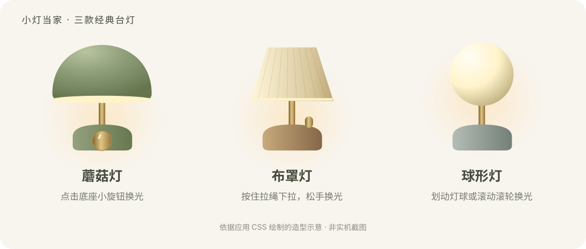
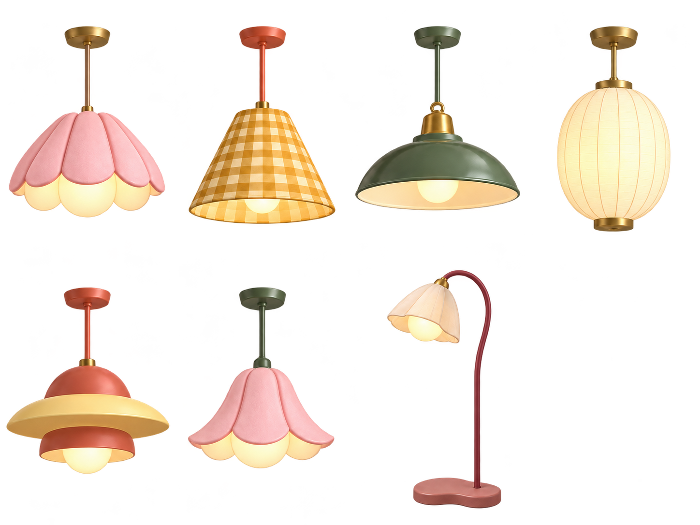

# 小灯当家

**你的桌面，小灯当家。**

一款可以放在桌面角落的小灯工具。拉一下绳、摸一下灯球，让灯光呼应你的阅读模式。支持 macOS 和 Windows，提供十款灯具，可拖动、收起并记住位置。

> 公开测试版：当前 Mac 0.5.6 / Windows 0.1.3。已完成模拟测试和本机测试。

## 下载

请进入本仓库右侧 **Releases**，选择最新的测试版，在 **Assets** 中按系统下载：

| 系统 | 下载文件 | 打开方式 |
| --- | --- | --- |
| macOS 12 或更高版本 | 小灯当家-Mac-v0.5.6-自由拖动版.zip | 完整解压，双击「安装小灯当家.command」，在本机生成应用 |
| Windows 10/11 x64 | 小灯当家-Windows-v0.1.3-自由拖动版.zip | 完整解压，双击根目录「启动小灯当家.cmd」 |

请下载以上命名的应用包。GitHub 自动提供的 **Source code (zip)** 是源码，不是 Windows 可运行版。

Windows 的 exe 依赖同目录文件，不能单独拖到桌面。如需桌面入口，请运行「创建桌面快捷方式.cmd」。升级前先退出旧版。

## 灯具：共十款

### 三款经典台灯

| 灯具 | 造型 | 换光方式 |
| --- | --- | --- |
| 蘑菇灯 | 鼠尾草绿圆弧灯罩，黄铜灯杆与小旋钮 | 点击底座旋钮 |
| 布罩灯 | 奶油色布纹灯罩，暖木色底座 | 按住拉绳向下拉，松手换档 |
| 球形灯 | 柔光球形灯罩，灰绿色底座 | 在灯球上划动或滚动滚轮 |

*以上为依据应用 CSS 绘制的造型示意，不是实机截图。*

### 六款吊灯与一款落地灯

| 灯具 | 换光方式 |
| --- | --- |
| 花瓣吊灯 | 下拉拉绳后松手 |
| 格纹吊灯 | 在灯罩上划动或滚动滚轮 |
| 复古搪瓷吊灯 | 下拉拉绳后松手 |
| 纸月灯笼 | 在灯罩上划动或滚动滚轮 |
| 奶油飞碟吊灯 | 在灯罩上划动或滚动滚轮 |
| 铃兰吊灯 | 下拉拉绳后松手 |
| 折叶落地灯 | 下拉拉绳后松手 |

*图示为应用使用的七款 3D 风格静态灯具素材，不是实机截图。十款灯具均可拖动，并分别记住位置。*

## 怎么玩

- **换光**：蘑菇灯点旋钮；带拉绳的灯按住绳坠下拉后松手；触摸灯在灯罩上按住划动或滚动滚轮。
- **移动**：拖动灯身，或悬停后按住左上角「⠿」移动手柄。每款灯具分别记住位置。
- **收起**：悬停后点右上角「−」，保留当前灯光效果。
- **换灯／退出**：Mac 顶部菜单栏、Windows 右下角托盘中的小灯图标。Windows 图标可能在「^」中。

## 四档阅读模式

| 模式 | 系统外观 | 覆盖效果 |
| --- | --- | --- |
| 日间 | 浅色 | 无 |
| 暖光 | 浅色 | 约 13% 不透明度的暖色滤层 |
| 夜读 | 深色 | 无 |
| 微光 | 深色 | 约 23% 不透明度的黑色滤层 |

滤层允许鼠标穿透，不是硬件亮度或系统夜间色温调节。网站需要自身支持跟随系统主题；本工具不会强制改写所有网页颜色，也不宣称医疗护眼效果。

**退出时会移除滤层，但保留系统浅／深色设置，不会自动恢复启动前外观。** Windows 会修改当前账户的应用及系统外观偏好；Mac 首次切换可能请求控制 System Events 的自动化权限。

## 当前限制与故障处理

- Mac 包为本机编译、自签名方案；Windows 为未签名便携测试包，均尚未完成正式发行签名流程。
- Windows 暖光曾出现整屏不透明问题，0.1.2 起改用独立窗口透明度并在显示前检查；仍需实机验证。
- 若退出后任务栏时间显示异常，请在系统「个性化 → 颜色」重新切换浅色；仍异常时，等待文件复制完成后，在任务管理器重启 Windows 资源管理器。
- 若生成 debug 日志并提示 ICU data 错误，优先检查是否单独移动了 exe、是否完整解压。不要从其他网站单独下载同名 DLL 或数据文件替换。
- 全屏应用、不同显卡驱动和多显示器缩放组合仍需验证。

详细说明：[Mac](desktop-lamp/使用说明.md) / [Windows](windows-lamp/使用说明.md)。

## 反馈

欢迎在 **Issues** 描述：系统版本、小灯当家版本、所用灯型和档位、复现步骤、预期与实际效果。截图或日志请先去掉个人信息。

## 开发

- `desktop-lamp/`：JXA + AppKit + WebKit，macOS 本机运行安装脚本构建。
- `windows-lamp/`：Electron；安装 Node.js 22 或更高的受支持版本，运行 `npm ci`、`npm start`；`npm run package:win` 生成 Windows x64 程序目录。
- `windows-launchers/`：发布包根目录的启动与快捷方式脚本。打包时须与「小灯当家」程序目录同级放置。
- 测试：在仓库根目录运行 `node --test desktop-lamp/tests/*.test.cjs windows-lamp/tests/*.test.cjs`。

当前 52 项模拟测试覆盖外观切换、失败回退、滤层、移动、记忆位置与灯具交互；不等同于 Mac / Windows 实机验证。

## 授权状态

当前尚未选择项目的开源许可证，源码公开供查看。代码与灯具素材的进一步授权方式待明确。第三方组件遵循其各自许可证；Windows 发布包保留 Electron 和 Chromium 的许可文件。
